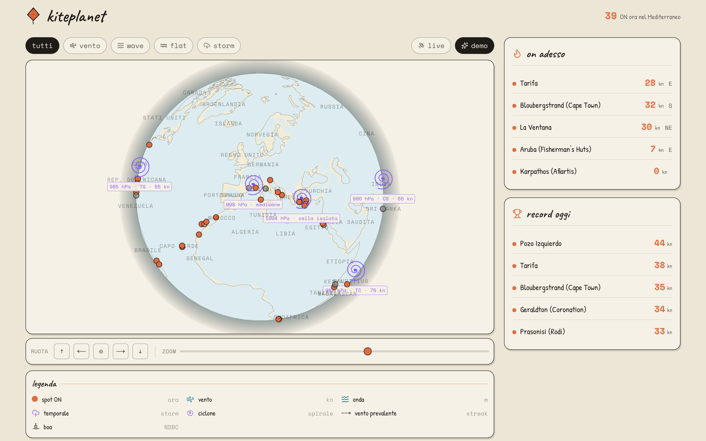

# Kiteplanet

> **🌐 Vetrina & screenshot → [nambaf.github.io/kiteplanet-oss](https://nambaf.github.io/kiteplanet-oss/)**
> &nbsp;·&nbsp; **🚀 Demo live → [kiteplanet.vercel.app](https://kiteplanet.vercel.app)** <!-- TODO: sostituisci con l'URL Vercel reale dopo il deploy -->

[](https://github.com/nambaf/kiteplanet-oss/actions/workflows/ci.yml)
[](https://nambaf.github.io/kiteplanet-oss/)
[](./LICENSE)


> Trova lo spot di kitesurf giusto. Vento, onda e marea da sorgenti open data,
> su un globo interattivo. Niente login, niente database, niente API key obbligatorie.

PWA Next.js 15 (App Router) + React 19 + TypeScript strict, estetica "carta sketchy".



---

## Avvio

```bash
git clone https://github.com/nambaf/kiteplanet-oss
cd kiteplanet-oss
pnpm install
pnpm dev          # http://localhost:3000
```

Richiede Node ≥ 20 e pnpm ≥ 10. **Funziona out-of-the-box senza nessuna chiave**: i
50 spot sono in `src/data/spots/`, le previsioni arrivano da Open-Meteo (gratuito, no key).

[](https://vercel.com/new/clone?repository-url=https://github.com/nambaf/kiteplanet-oss)

---

## Architettura — i punti interessanti

- **Provider Registry + `withResilience`** (`src/lib/providers/`): ogni sorgente esterna
  passa per un wrapper unico che applica timeout via `AbortController`, cattura gli errori
  e ritorna sempre uno di 5 stati (`live` · `unavailable` · `requires-key` · `disabled` ·
  `demo`). Nessuna pagina bianca, nessun loading infinito: la UI si adatta allo stato.
- **Streaming SSR per-sezione**: la shell della spot page renderizza subito; ogni provider
  ha la sua `<Suspense>` e streama appena pronto (un provider lento non blocca gli altri).
  I fetcher sono memoizzati per-request con `cache()` di React → dedupe gratis tra boundary.
- **Modalità `demo` / `live`**: toggle persistito su cookie (idratazione server-side, zero
  flash) + localStorage di fallback. In demo i dati sono mock deterministici, in live arrivano
  dai provider reali.
- **Globo three.js**: terra triangolata con earcut (gestione antimeridiano), coste reali da
  world-atlas, atmosfera Fresnel, pin con snapshot live e cicloni come spirali rotanti.

---

## Sorgenti dati

Cinque sorgenti gratuite/freemium dietro un'astrazione comune (`src/lib/providers/`):

| Provider | Categoria | Key | Free tier |
|---|---|---|---|
| **Open-Meteo** | vento, onda, SST | no | illimitato |
| **NOAA NDBC** | osservazioni real-time (boe) | no | illimitato |
| **NHC** | cicloni tropicali attivi | no | illimitato |
| **Wikipedia** | summary enciclopedico | no | illimitato |
| **Stormglass** | maree | sì | 10 req/giorno |

L'app gira al 100% senza API key: i provider che ne richiedono una mostrano un badge
"API key required" finché non la aggiungi in `.env.local` (vedi [`.env.example`](./.env.example)).
La pagina `/data-sources` (bilingue IT/EN) descrive ogni provider con cosa fornisce, come
viene usato, env vars, license e gli spot che lo consumano.

---

## Stack

Next.js 15 · React 19 · TypeScript strict · Tailwind 3 · three.js · topojson + world-atlas
+ earcut · Vitest · pnpm.

## Comandi

```bash
pnpm dev          # dev server
pnpm build        # build di produzione
pnpm start        # serve la build
pnpm typecheck    # tsc --noEmit
pnpm lint         # next lint
pnpm test         # vitest run
```

## Contribuire

Le PR sono benvenute. Vedi [CONTRIBUTING.md](./CONTRIBUTING.md). Spot nuovi (`src/data/spots/`) e nuovi provider (dietro
`withResilience`) sono i contributi più graditi.

## Sicurezza

Se trovi una vulnerabilità che riguarda *ogni* deployment di questo codice (non solo la tua
istanza), segui [SECURITY.md](./SECURITY.md) invece di aprire una issue pubblica.

## Codice di condotta

Vedi [CODE_OF_CONDUCT.md](./CODE_OF_CONDUCT.md).

## Licenza

[MIT](./LICENSE).
